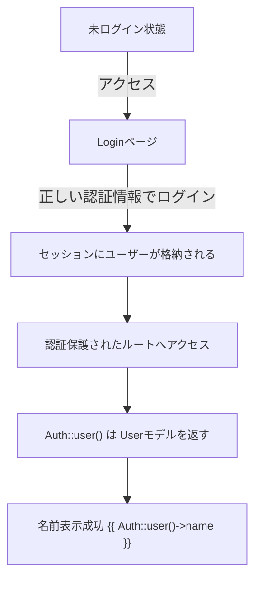
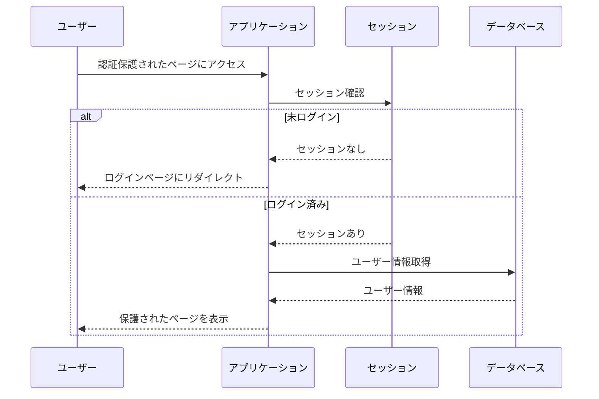

# Laravel Breeze: 認証フローとルーティングの解説

## エラーケース

未ログイン状態で `Auth::user()->name` にアクセスした場合に発生するエラー：
```
Attempt to read property "name" on null
```

## 認証フロー

### 画面遷移フロー


### 認証シーケンス


## web.php のルーティング構成

### 基本ルート
- `/` - トップページ（未認証でもアクセス可能）
- `/dashboard` - ダッシュボード（認証必須）

### 認証保護されたルートグループ
`middleware('auth')` で保護された以下のルート：
- `/profile` (GET) - プロフィール編集画面
- `/profile` (PATCH) - プロフィール更新
- `/profile` (DELETE) - プロフィール削除
- `/users` (GET) - ユーザー一覧

### 認証関連のルート
`routes/auth.php` で定義される以下のルート：
- `/login` - ログイン画面
- `/register` - ユーザー登録画面

## 実装上の注意点

### コントローラでの認証保護
```php
Route::middleware(['auth'])->group(function () {
    Route::get('/users', [UserController::class, 'index']);
});
```

### Bladeテンプレートでの防御的コーディング
```blade
@if (Auth::check())
    <div>{{ Auth::user()->name }}</div>
@else
    <div>ゲスト</div>
@endif
```

## 確認事項

1. データベースの準備
   - `php artisan migrate` の実行
   - `users` テーブルの存在確認
   - テストユーザーの作成

2. 認証設定の確認
   - ログイン機能の動作確認
   - 認証保護されたルートへのアクセス制御
   - ミドルウェアの設定確認

## まとめ

- 認証が必要なルートは必ず `auth` ミドルウェアで保護する
- 未認証状態での `Auth::user()` の使用は避ける
- 認証状態に応じた適切な防御的コーディングを実装する

