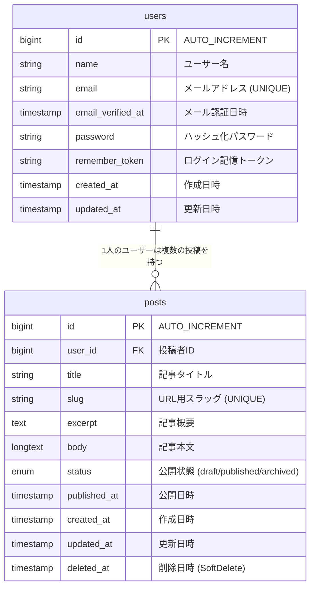
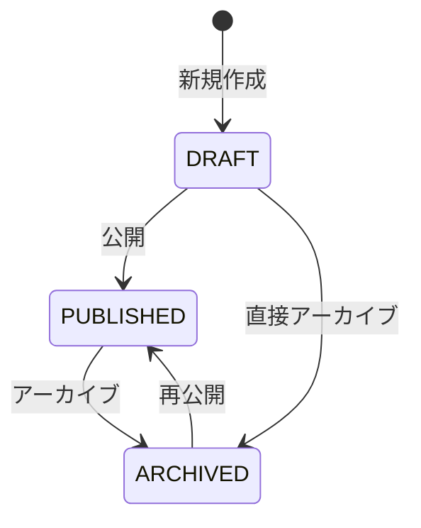

# ブログシステム ERD

## データベース構造図



## ERD記号の意味

- `||`: 1（必須）
- `o{`: 多数（0個以上）
- `||--o{`: 1対多のリレーション（1つのユーザーは0個以上の投稿を持つ）

## リレーションシップの詳細

### User → Post (HasMany)
```php
// User.php
public function posts(): HasMany
{
    return $this->hasMany(Post::class);
}

public function publishedPosts(): HasMany
{
    return $this->hasMany(Post::class)->where('status', 'published');
}
```

### HasManyを使用する意味・メリット

#### 1. **簡潔なコード記述**
```php
// HasManyなし（生のSQL）
$posts = DB::select('SELECT * FROM posts WHERE user_id = ?', [$userId]);

// HasManyあり（Eloquent）
$posts = $user->posts;  // 1行で取得
```

#### 2. **遅延読み込み（Lazy Loading）**
```php
$user = User::find(1);
$posts = $user->posts;  // この時点でクエリ実行（必要時のみ）
```

#### 3. **積極的読み込み（Eager Loading）でN+1問題解決**
```php
// N+1問題が発生するパターン
$users = User::all();
foreach ($users as $user) {
    echo $user->posts->count(); // ユーザー数分クエリ実行
}

// Eager Loadingで1回のクエリで解決
$users = User::with('posts')->get();
foreach ($users as $user) {
    echo $user->posts->count(); // 追加クエリなし
}
```

#### 4. **関連データの作成・追加が簡単**
```php
$user = User::find(1);

// 新しい投稿を作成してユーザーと関連付け
$post = $user->posts()->create([
    'title' => 'タイトル',
    'slug' => 'slug',
    'body' => '本文',
    'status' => PostStatus::DRAFT
]);

// 既存の投稿をユーザーと関連付け
$user->posts()->save($existingPost);
```

#### 5. **条件付きクエリも簡単**
```php
// 公開済み投稿のみ取得
$publishedPosts = $user->posts()->where('status', 'published')->get();

// 最新5件の投稿
$latestPosts = $user->posts()->orderBy('created_at', 'desc')->take(5)->get();

// 投稿数をカウント
$postCount = $user->posts()->count();
```

**使用例:**
```php
$user = User::find(1);
$allPosts = $user->posts;              // ユーザーの全投稿
$publishedPosts = $user->publishedPosts; // 公開済み投稿のみ
$postCount = $user->posts->count();    // 投稿数
```

### Post → User (BelongsTo)
```php
// Post.php
public function author(): BelongsTo
{
    return $this->belongsTo(User::class, 'user_id');
}
```

**使用例:**
```php
$post = Post::find(1);
$author = $post->author;  // 投稿者情報を取得
```

## データベース制約

### 外部キー制約
- `posts.user_id` → `users.id`
- **ON DELETE CASCADE**: ユーザー削除時、関連投稿も削除
- **外部キー名**: `posts_user_id_foreign`

### インデックス
- `posts.slug` (UNIQUE)
- `posts.status` (INDEX)
- `posts.published_at` (INDEX)
- `posts.user_id` (FOREIGN KEY INDEX)

## PostStatus Enum

```php
enum PostStatus: string
{
    case DRAFT = 'draft';         // 下書き
    case PUBLISHED = 'published'; // 公開済み
    case ARCHIVED = 'archived';   // アーカイブ
}
```

### ステータス遷移


## SoftDelete機能
- `posts.deleted_at`カラムによる論理削除
- 削除されたデータも物理的には残存
- 復元可能

## 使用例

### 投稿一覧の取得
```php
// 公開済み投稿を投稿者情報付きで取得
$posts = Post::with('author')
    ->where('status', PostStatus::PUBLISHED)
    ->orderBy('published_at', 'desc')
    ->get();
```

### ユーザーの投稿数取得
```php
$user = User::withCount('posts')->find(1);
echo $user->posts_count; // 投稿数
```