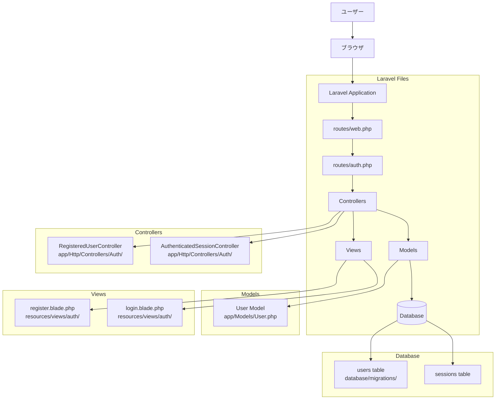
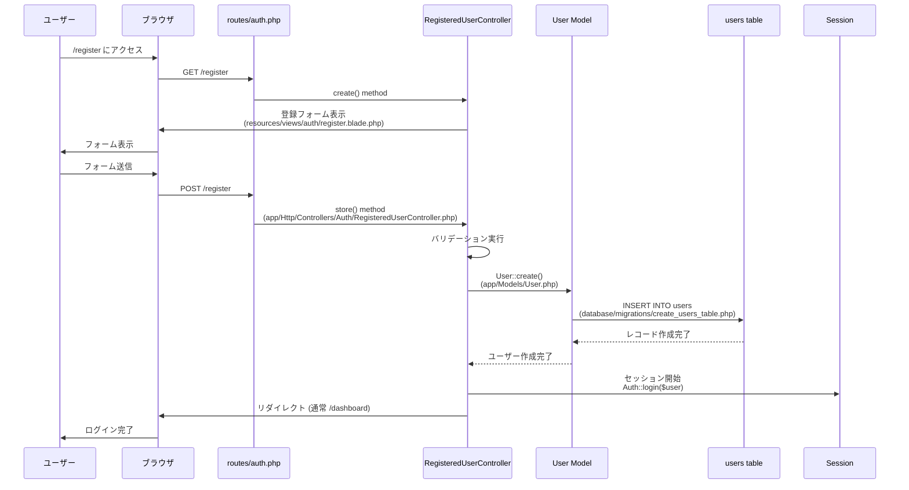
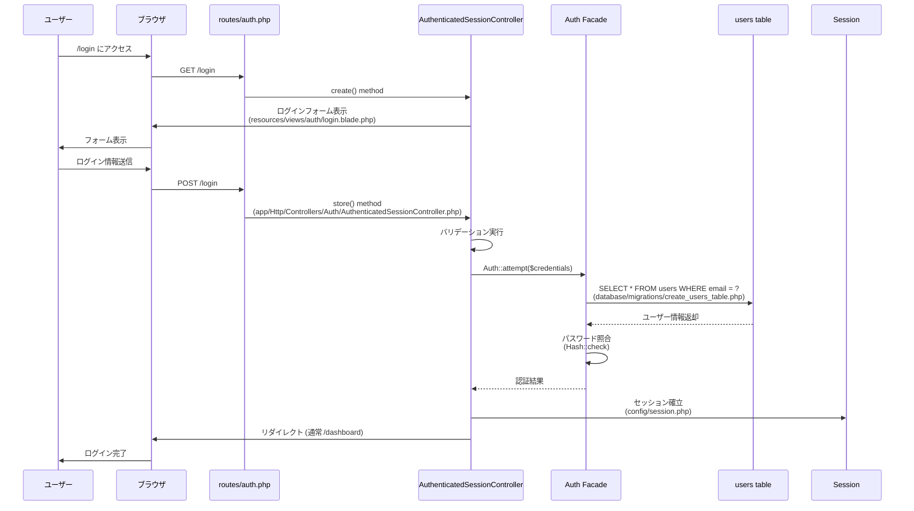
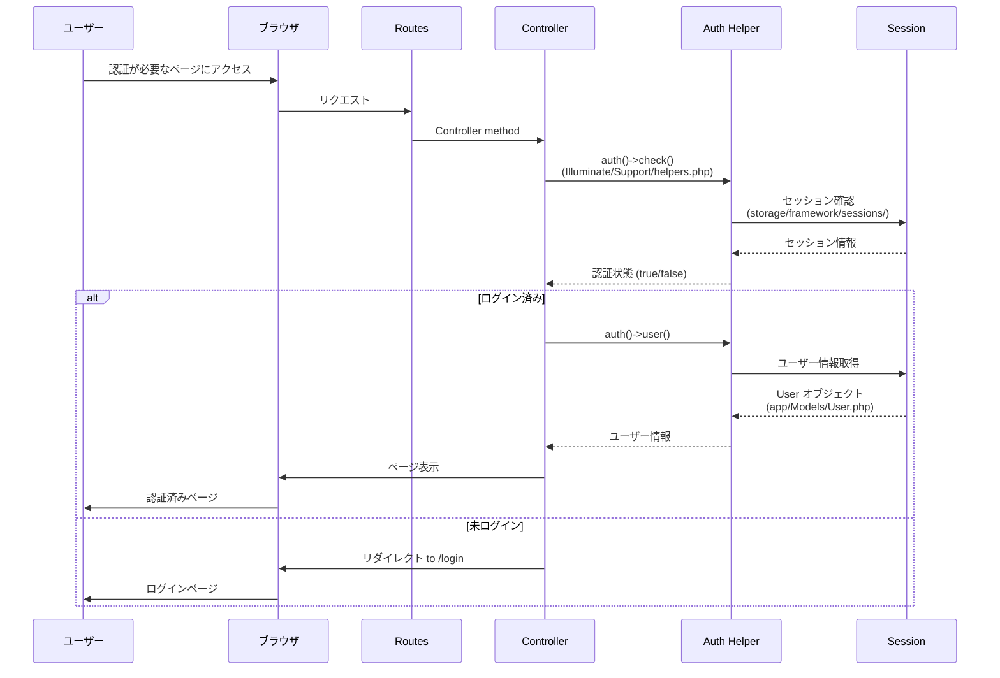
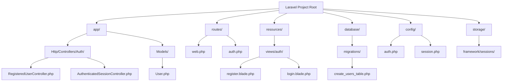

## 新規登録フロー

## ログインフロー

## 認証状態確認フロー

## ファイル構成

## 重要ポイント
- Breezeが認証に必要な全てを自動生成
- `/login` や `/register` は特別なルートではなく、普通のルート
- ログイン後は `auth()->user()` でユーザー情報にアクセス可能
- セッションで認証状態を管理

## 次のステップ
1. 実際にユーザー登録してみる
2. `auth()->user()` の値を確認する（`dd(auth()->user())`）
3. ログイン状態での画面表示を試す